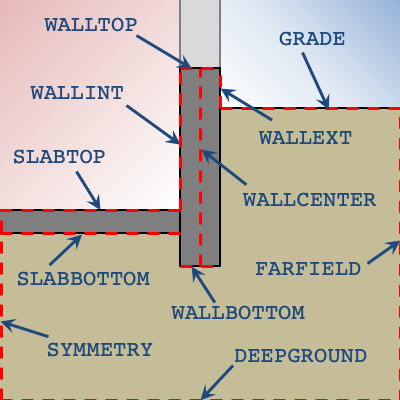
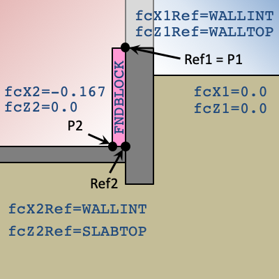

# FNDBLOCK

Foundation blocks are materials within the two-dimensional domain beyond those defined by the slab and wall SURFACEs. Each block is represented as a rectangle in the domain by specifying the X (lateral) and Z (vertical) coordinates of two opposite corners. The coordinate system for each point is relative to the X and Z references defined by the user. As a convention The positive X direction is away from the building, and the positive Z direction is down.

Options for X and Z references are illustrated in the figure below.

The default reference is WALLINT, WALLTOP.

An example of defining a block for interior wall insulation is shown below. Here the two points defining the block (P1 and P2) are both shown relative to their reference points (Ref1 and Ref2, respectively).

Note: X and Z point values of zero imply that a point is the same as the reference point. The default for X and Z point values is zero since points will often align with one or both of the reference values.

It does not matter which of the four corners of a block are used to define the two points as long as they are opposite corners.

### fbMat

Type: *matName*

Name of MATERIAL of the foundation block.

{{
  member_table({
    "units": None,
    "legal_range": "Name of a *Material*", 
    "default": "*none*",
    "required": "Yes",
    "variability": "constant" 
  })
}}

### fbX1Ref

Type: *choice*

Relative X origin for *fbX1* point. Options are:

- SYMMETRY
- WALLINT
- WALLCENTER
- WALLEXT
- FARFIELD

{{
  member_table({
    "units": "",
    "legal_range": "*choices above*", 
    "default": "WALLINT",
    "required": "No",
    "variability": "constant" 
  })
}}

### fbZ1Ref

Type: *choice*

Relative Z origin for *fbZ1* point. Options are:

- WALLTOP
- GRADE
- SLABTOP
- SLABBOTTOM
- WALLBOTTOM
- DEEPGROUND

{{
  member_table({
    "units": "",
    "legal_range": "*choices above*", 
    "default": "WALLTOP",
    "required": "No",
    "variability": "constant" 
  })
}}

### fbX1

Type: *float*

The X position of the first corner of the block relative to *fbX1Ref*.

{{
  member_table({
    "units": "ft",
    "legal_range": "", 
    "default": "0.0",
    "required": "No",
    "variability": "constant" 
  })
}}

### fbZ1

Type: *float*

The Z position of the first corner of the block relative to *fbZ1Ref*.

{{
  member_table({
    "units": "ft",
    "legal_range": "", 
    "default": "0.0",
    "required": "No",
    "variability": "constant" 
  })
}}

### fbX2Ref

Type: *choice*

Relative X origin for *fbX2* point. Options are:

- SYMMETRY
- WALLINT
- WALLCENTER
- WALLEXT
- FARFIELD

{{
  member_table({
    "units": "",
    "legal_range": "*choices above*", 
    "default": "WALLINT",
    "required": "No",
    "variability": "constant" 
  })
}}

### fbZ2Ref

Type: *choice*

Relative Z origin for *fbZ2* point. Options are:

- WALLTOP
- GRADE
- SLABTOP
- SLABBOTTOM
- WALLBOTTOM
- DEEPGROUND

{{
  member_table({
    "units": "",
    "legal_range": "*choices above*", 
    "default": "WALLTOP",
    "required": "No",
    "variability": "constant" 
  })
}}

### fbX2

Type: *float*

The X position of the second corner of the block relative to *fbX2Ref*.

{{
  member_table({
    "units": "ft",
    "legal_range": "", 
    "default": "0.0",
    "required": "No",
    "variability": "constant" 
  })
}}

### fbZ2

Type: *float*

The Z position of the second corner of the block relative to *fbZ2Ref*.

{{
  member_table({
    "units": "ft",
    "legal_range": "", 
    "default": "0.0",
    "required": "No",
    "variability": "constant" 
  })
}}

### endFndBlock

Indicates the end of the foundation block definition. Alternatively, the end of the foundation block definition can be indicated by the declaration of another object or by END.

{{
  member_table({
    "units": "",
    "legal_range": "", 
    "default": "*none*",
    "required": "No",
    "variability": "constant" 
  })
}}
