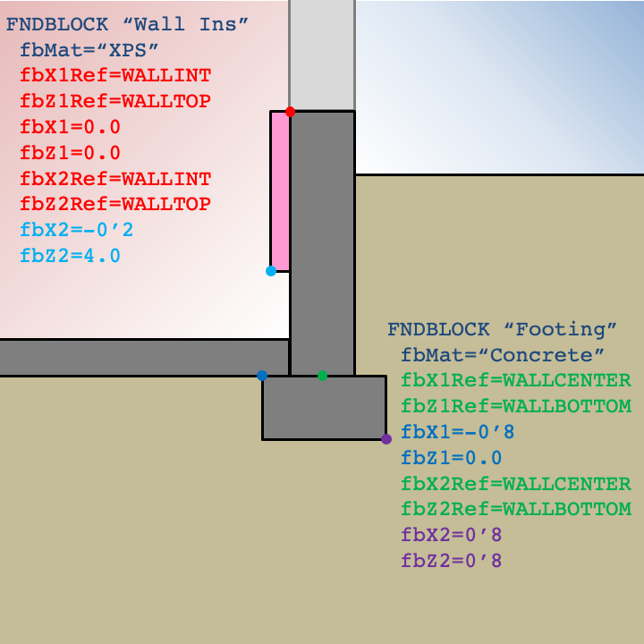

# FNDBLOCK

Foundation blocks are materials within the two-dimensional domain beyond those defined by TOP soil properties, the parent FOUNDATION object, and floor and wall SURFACEs. Common examples of using FNDBLOCKs include representing:

- Perimeter slab insulation
- Slab gap insulation
- Partial interior wall insulation
- Exterior horizontal or vertical insulation
- Concrete footings

Each block is represented as a rectangle in the domain by specifying the X (lateral) and Z (vertical) coordinates of two opposite corners. It does not matter which of the four corners of a block are used to define the two points as long as they are opposite corners. The coordinate system for each point is relative to the X and Z references defined by the user. By convention, the positive X direction is away from the building, and the positive Z direction is down. FNDBLOCKs that overlap materials defined by TOP, FOUNDATION, SURFACE objects, or previously defined FNDBLOCKs will override the thermal properties within the extents of the FNDBLOCK.

Each corner point of a FNDBLOCK is defined relative to its reference point. The user may specify reference points to simplify the calculation of corner point coordinates. X and Z point values of zero imply that a point is the same as the reference point. The default for X and Z point values is zero since points will often align with one or both of the reference values. Options for X and Z references are illustrated in the figure below.

The default X and Z references for the first corner point is WALLINT and WALLTOP, respectively. The second set of references default to the same reference as the first point.

An example of defining FNDBLOCKs for a basement are shown below.

The example for a slab foundation shown below illustrates how leveraging default values can simplify user input.

### fbMat

Type: matName

Name of MATERIAL of the foundation block.

{{
  member_table({
    "legal_range": "Name of a *Material*",
    "default": "*none*", 
    "required": "Yes",
    "variability": "constant" 
  })
}}

### fbX1Ref

Type: choice

Relative X origin for *fbX1* point. Options are:

- SYMMETRY
- WALLINT
- WALLCENTER
- WALLEXT
- FARFIELD

{{
  member_table({
    "units": "",
    "legal_range": "*choices above*", 
    "default": "WALLINT",
    "required": "No",
    "variability": "constant" 
  })
}}

### fbZ1Ref

Type: choice

Relative Z origin for *fbZ1* point. Options are:

- WALLTOP
- GRADE
- SLABTOP
- SLABBOTTOM
- WALLBOTTOM
- DEEPGROUND

{{
  member_table({
    "units": "",
    "legal_range": "*choices above*", 
    "default": "WALLTOP",
    "required": "No",
    "variability": "constant" 
  })
}}

### fbX1

Type: float

The X position of the first corner of the block relative to *fbX1Ref*.

{{
  member_table({
    "units": "ft",
    "legal_range": "", 
    "default": "0.0",
    "required": "No",
    "variability": "constant" 
  })
}}

### fbZ1

Type: float

The Z position of the first corner of the block relative to *fbZ1Ref*.

{{
  member_table({
    "units": "ft",
    "legal_range": "", 
    "default": "0.0",
    "required": "No",
    "variability": "constant" 
  })
}}

### fbX2Ref

Type: choice

Relative X origin for *fbX2* point. Options are:

- SYMMETRY
- WALLINT
- WALLCENTER
- WALLEXT
- FARFIELD

{{
  member_table({
    "units": "",
    "legal_range": "*choices above*", 
    "default": "same as *fbX1Ref*",
    "required": "No",
    "variability": "constant" 
  })
}}

### fbZ2Ref

Type: choice

Relative Z origin for *fbZ2* point. Options are:

- WALLTOP
- GRADE
- SLABTOP
- SLABBOTTOM
- WALLBOTTOM
- DEEPGROUND

{{
  member_table({
    "units": "",
    "legal_range": "*choices above*", 
    "default": "same as *fbZ1Ref*",
    "required": "No",
    "variability": "constant" 
  })
}}

### fbX2

Type: float

The X position of the second corner of the block relative to *fbX2Ref*.

{{
  member_table({
    "units": "ft",
    "legal_range": "", 
    "default": "0.0",
    "required": "No",
    "variability": "constant" 
  })
}}

### fbZ2

Type: float

The Z position of the second corner of the block relative to *fbZ2Ref*.

{{
  member_table({
    "units": "ft",
    "legal_range": "", 
    "default": "0.0",
    "required": "No",
    "variability": "constant" 
  })
}}

### endFndBlock

Indicates the end of the foundation block definition. Alternatively, the end of the foundation block definition can be indicated by the declaration of another object or by END.

{{
  member_table({
    "units": "",
    "legal_range": "", 
    "default": "*none*",
    "required": "No",
    "variability": "constant" 
  })
}}
