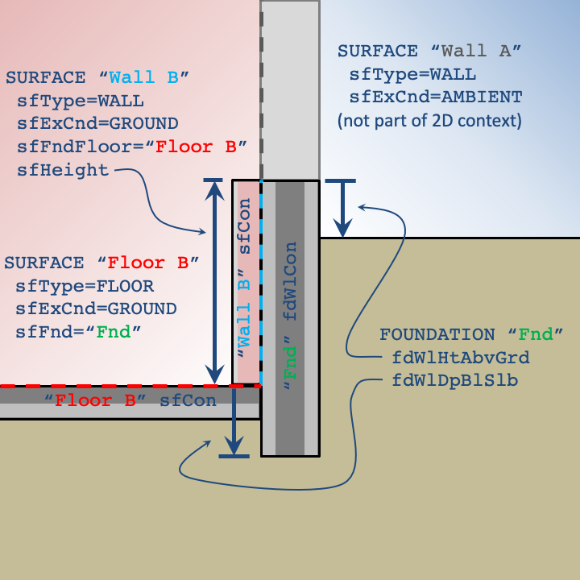

# FOUNDATION

Foundation describes the two-dimensional relationship between ground-contact SURFACEs (i.e., **sfExCnd** = GROUND) and the surrounding ground. A FOUNDATION is referenced by ground-contact floor SURFACEs (see **sfFnd**). FOUNDATIONs are used to describe the two-dimensional features of foundation designs that cannot be captured by the typical one-dimensional CONSTRUCTIONs. The dimensions from the one-dimensional CONSTRUCTIONs associated with ground-contact floors and walls are automatically interpreted into the two-dimensional context.

/// caption
Two-dimensional context for a slab foundation
///

/// caption
Two-dimensional context with below grade walls
///

Any ground-contact wall SURFACEs in contact with the ground must refer to a Floor SURFACE object (see **sfFndFloor**) to indicate which floor shares the same ground boundary condition in the two-dimensional context.

MATERIALs used in a FOUNDATION cannot have variable properties at this time.

Some of the relevant dimensions and properties in the two-dimensional context are defined in the FOUNDATION object (and FNDBLOCK subobjects), but several others are specified by the corresponding SURFACE objects:

- sfFnd
- sfFndFloor
- sfHeight
- sfExpPerim
- sfCon

Some properties applying to all FOUNDATIONs are defined at the TOP level:

- soilCond
- soilSpHt
- soilDens
- grndEmiss
- grndRefl
- grndRf
- farFieldWidth
- deepGrndCnd
- deepGrndDepth
- deepGrndT
- grndMinDim
- grndMaxGrthCoeff
- grndTimeStep

The following data members describe the dimensions and properties of the structural foundation wall. The height of the foundation wall (from the top of the wall to the top of the slab) is defined by **sfHeight** in wall SURFACEs that specify the same **sfFndFloor** that references the FOUNDATION (through **sfFnd**).

Other components of the foundation design (e.g., interior/exterior insulation) as well as other variations in thermal properties within the ground are defined using FNDBLOCK (foundation block) objects. Any number of FNDBLOCKs can appear after the definition of a FOUNDATION to be properly associated.

### fdName

Name of foundation; give after the word FOUNDATION. Required for reference from SURFACE objects.

{{
  member_table({
    "legal_range": "*63 characters*",
    "default": "*none*", 
    "required": "Yes",
    "variability": "constant" 
  })
}}

### fdWlHtAbvGrd

Type: float

Distance between the grade level and the top of the foundation wall.

{{
  member_table({
    "units": "ft",
    "legal_range": "x ≥ 0", 
    "default": "0.5",
    "required": "No",
    "variability": "constant" 
  })
}}

### fdWlDpBlwSlb

Type: float

Distance between the bottom of the slab and the bottom of the foundation wall. Foundation walls typically extend to the bottom of the slab and rest on a footing. If the footing isn't explicitly modeled as a FNDBLOCK, this value can be extended to approximate the footing.

{{
  member_table({
    "units": "ft",
    "legal_range": "x ≥ 0", 
    "default": "0.0",
    "required": "No",
    "variability": "constant" 
  })
}}

### fdWlCon

Type: conName

Name of the CONSTRUCTION for the structural foundation wall. In the two-dimensional context, this construction spans from the top of the foundation wall to its depth below the slab (*fdWlDpBlwSlb*). Any construction on the interior of the wall (spanning from the top of the foundation wall to the top of the slab), must be defined by the *sfCon* of the corresponding wall surface. Typically, this CONSTRUCTION will be a single layer of poured concrete.

{{
  member_table({
    "legal_range": "Name of a *Construction*",
    "default": "*none*", 
    "required": "Yes",
    "variability": "constant" 
  })
}}

### endFoundation

Indicates the end of the foundation definition. Alternatively, the end of the foundation definition can be indicated by the declaration of another object or by END.

{{
  member_table({
    "units": "",
    "legal_range": "", 
    "default": "*none*",
    "required": "No",
    "variability": "constant" 
  })
}}
